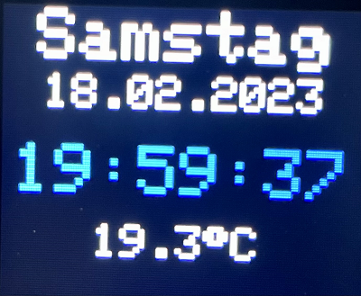

|[:skull:ISSUE](https://github.com/frankyhub/ESP32-RTC-Clock/issues?q=is%3Aissue)|[:speech_balloon: Forum /Discussion](https://github.com/frankyhub/ESP32-RTC-Clock/discussions)|[:grey_question:WiKi](https://github.com/frankyhub/ESP32-RTC-Clock/wiki)||
|--|--|--|--|
| | | | |
||<a href="https://github.com/frankyhub/ESP32-RTC-Clock/issues">|<a href="https://github.com/frankyhub/ESP32-RTC-Clock/discussions">|<a href="https://github.com/frankyhub/ESP32-RTC-Clock/releases">|
|| <a href="https://github.com/frankyhub/ESP32-RTC-Clock/pulse" alt="Activity">| <a href="https://github.com/frankyhub/ESP32-RTC-Clock/graphs/traffic">  |<a href="https://github.com/frankyhub?tab=stars"> |

# ESP32-RTC-Clock
Datum, Uhrzeit, Temperatur, Farbdisplay

## Story

In diesem Projekt wird mit einem ESP32 und einen RTC-Modul der Wochentag, das Datum, die Uhrzeit und die Temperatur auf einem TFT 1.77"-Display angezeigt. Mit Verwendung des RTC-Moduls ist kein WLAN notwendig.
Es empfiehlt sich vor der eigentlichen Inbetriebnahme das RTC-Modul mit einem Set-Programm auf die aktuelle Uhrzeit einzustellen.

ESP32 RTC Clock Anzeige

## Hardware

+ 1 x ESP32
+ 1 x TFT 1,77" Display
+ 1 x RTC-Modul DS3231 I2C

## Verdrahtung

+ RTC Modul -> 5V und GND
+ RTC Modul SDL -> ESP32 SDL
+ RTC Modul SDA -> ESP32 SDA
+ TFT-Display 5V und GND -> 5V und GND
+ TFT-Display SCK-> ESP32 18
+ TFT-Display SDA (MOSI) -> ESP32 23
+ TFT-Display RES (RST) -> ESP32 14
+ TFT-Display RS (DC) -> ESP32 13
+ TFT-Display CS -> ESP32 12
+ TFT-Display LEDA-> ESP32 3,3V

---

   
<ol class="breadcrumb" style="border-top: 2px solid black;border-bottom:2px solid black; height: 45px; width: 900px;"> 
<a href="#oben">nach oben</a>
</ol>

  

---

